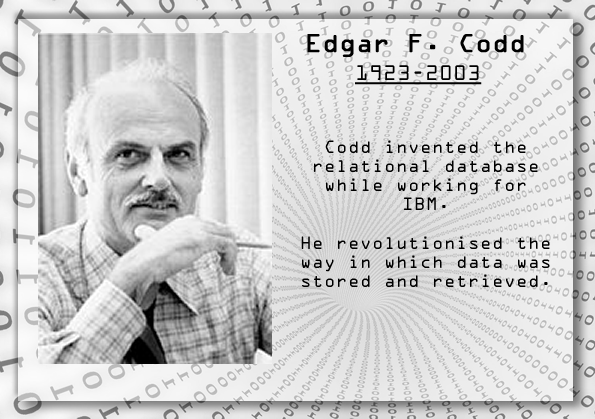

# Edgar F. Codd: Il Padre del Modello Relazionale

---

## Chi è Edgar F. Codd?

- **Nato il 23 agosto 1923 a Portland, Inghilterra.**
- **Dottorato in Matematica presso l'Università di Michigan nel 1953.**
- **Ingegnere e informatico britannico.**

---

## Contributo di Codd

Edgar F. Codd è noto per la formulazione del modello relazionale nel 1970 mentre lavorava per IBM. La sua proposta ha rivoluzionato il modo in cui i dati vengono memorizzati e manipolati nei database.

---

## Il Modello Relazionale

Codd ha introdotto il concetto di organizzare i dati in tabelle con righe e colonne, introducendo il concetto di chiave primaria per identificare univocamente le tuple.

---

## 12 Regole di Codd

Codd ha definito 12 regole, conosciute come le "Regole di Codd", per garantire l'integrità e l'efficacia del modello relazionale. Queste regole hanno contribuito a stabilire standard per i database relazionali.

---

# Eredità e Riconoscimenti

---

## Premi e Riconoscimenti

- Nel 1981, Edgar F. Codd è stato premiato con l'ACM Turing Award per il suo contributo fondamentale al campo della gestione dei dati.
- Nel 1994, ha ricevuto il premio Fellow dell'Association for Computing Machinery (ACM).

---

## Eredità Duratura

Il modello relazionale di Codd è diventato uno standard nell'industria informatica e ha influenzato lo sviluppo di numerosi database relazionali.

---

## Le 12 regole di Codd

Le **12 Regole di Codd** sono un insieme di principi definiti da Edgar F. Codd per descrivere i requisiti fondamentali di un sistema di gestione di database relazionale (RDBMS). L'obiettivo è garantire che i dati siano gestiti in modo strutturato, consistente e flessibile.

1. **Informazioni tutte in tabelle**: Tutte le informazioni sono organizzate in tabelle, rendendo i dati facilmente interpretabili e manipolabili.
2. **Accesso garantito**: Ogni valore in una tabella è univocamente identificabile grazie alla combinazione del nome della tabella, della chiave primaria e del valore stesso.
3. **Integrità delle informazioni**: Ogni dato deve rispettare vincoli di validità definiti da domini (es., tipi di dati) e regole di integrità (es., vincoli di unicità).
4. **Manipolazione dichiarativa dei dati**: Le query e le operazioni devono specificare "cosa fare" piuttosto che "come farlo", sfruttando il linguaggio SQL o equivalente.
5. **Vista logica indipendente**: Gli utenti possono interagire con i dati tramite viste personalizzate senza conoscere i dettagli di implementazione fisica.
6. **Modifiche strutturali online**: Cambiamenti alla struttura del database, come aggiunta o modifica di colonne, devono essere possibili senza interrompere il servizio.
7. **Indipendenza dai programmi**: Le modifiche nella struttura logica non devono richiedere modifiche ai programmi che accedono al database.
8. **Indipendenza dai cambiamenti fisici**: Cambiamenti nella struttura fisica (es., tipi di archiviazione) non devono influire sulle applicazioni.
9. **Gestione automatica delle transazioni**: Il sistema deve gestire le transazioni garantendo consistenza, isolamento e atomicità.
10. **Architettura distribuita**: Supporta la distribuzione dei dati su più sedi, garantendo prestazioni e accessibilità.
11. **Indipendenza dalle rappresentazioni casuali**: Il formato fisico o interno dei dati non deve influenzare la loro interpretazione o accessibilità.
12. **Accesso diretto per gli utenti finali**: Gli utenti possono interrogare il database senza dover passare attraverso complessi strati di interfacce.

Queste regole stabiliscono uno standard per i database relazionali, promuovendo flessibilità, sicurezza e interoperabilità.
