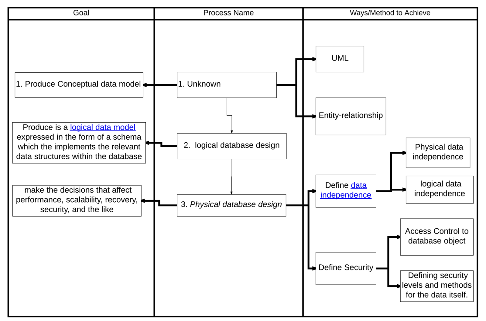

# Il modello concettuale e il modello logico

Il modello concettuale e il modello logico sono due fasi distinte nella progettazione di un database, ognuna con uno scopo specifico:

---

From Wikimedia Commons, the free media repository

---

1. **Modello Concettuale:**
   - Il **modello concettuale** rappresenta una visione ad alto livello dei dati e delle relazioni all'interno del sistema. Questa fase si concentra sulla comprensione dei concetti del mondo reale e delle relazioni tra di essi, indipendentemente dalle specifiche tecniche di implementazione.
   - L'obiettivo principale del **modello concettuale** è descrivere il dominio dell'applicazione e catturare le relazioni chiave tra le entità coinvolte nel sistema. Uno strumento comune utilizzato per questo scopo è il modello Entità-Relazione (ER).
   - Non fornisce dettagli implementativi, ma piuttosto una visione chiara e astratta del sistema.

---

2. **Modello Logico:**
   - Il **modello logico** rappresenta come le informazioni vengono effettivamente organizzate e memorizzate all'interno del database. In questa fase, si traducono i concetti astratti definiti nel **modello concettuale** in strutture di dati specifiche e regole di accesso.
   - Un **modello logico** può essere basato su paradigmi specifici come il **modello relazionale**, ad oggetti, gerarchico, o altri. Ad esempio, nel contesto del **modello relazionale**, il **modello logico** è rappresentato attraverso tabelle, attributi e relazioni.
   - L'obiettivo del **modello logico** è fornire una base concreta per l'implementazione fisica del database, indicando come i dati saranno organizzati e manipolati.

---

In breve, il **modello concettuale** si concentra sulla comprensione del dominio dell'applicazione e sulla definizione delle relazioni chiave, mentre il **modello logico** trasforma queste idee in una struttura di dati concreta per la memorizzazione e la gestione effettiva delle informazioni.

---

## dominio dell'applicazione

Il termine "dominio dell'applicazione" si riferisce al contesto o al settore specifico in cui un'applicazione software opera o è destinata a operare. In altre parole, è il campo o l'area di attività a cui appartiene un'applicazione e per la quale è stata progettata per fornire soluzioni o servizi.

---

Ecco alcuni esempi per chiarire il concetto:

1. **Dominio dell'Applicazione in un Contesto Aziendale:**
   - Nel contesto aziendale, il **dominio** dell'applicazione può essere il settore finanziario, la gestione delle risorse umane, la produzione, le vendite, o qualsiasi altra area di attività specifica di un'organizzazione. Ad esempio, un'applicazione di contabilità potrebbe appartenere al **dominio** finanziario.

---

2. **Dominio dell'Applicazione in un Contesto Scientifico:**
   - In un contesto scientifico, il **dominio** dell'applicazione potrebbe essere la biologia, la chimica, la fisica, o un altro campo specifico. Un'applicazione di analisi genetica, ad esempio, appartiene al **dominio** della biologia molecolare.

---

3. **Dominio dell'Applicazione in un Contesto Informatico:**
   - Nel campo dell'informatica, il **dominio** dell'applicazione può essere l'elaborazione delle immagini, l'intelligenza artificiale, il web development, e così via. Un'applicazione di riconoscimento vocale appartiene al **dominio** dell'elaborazione del linguaggio naturale.

---

Quando si progetta un sistema informatico, è fondamentale comprendere il **dominio** dell'applicazione per definire correttamente i requisiti, identificare le entità coinvolte e comprendere le relazioni tra di esse. 

---

Il **modello concettuale** di un database, ad esempio, è spesso progettato con una chiara comprensione del **dominio** dell'applicazione per garantire che rifletta accuratamente la realtà del settore di riferimento.
