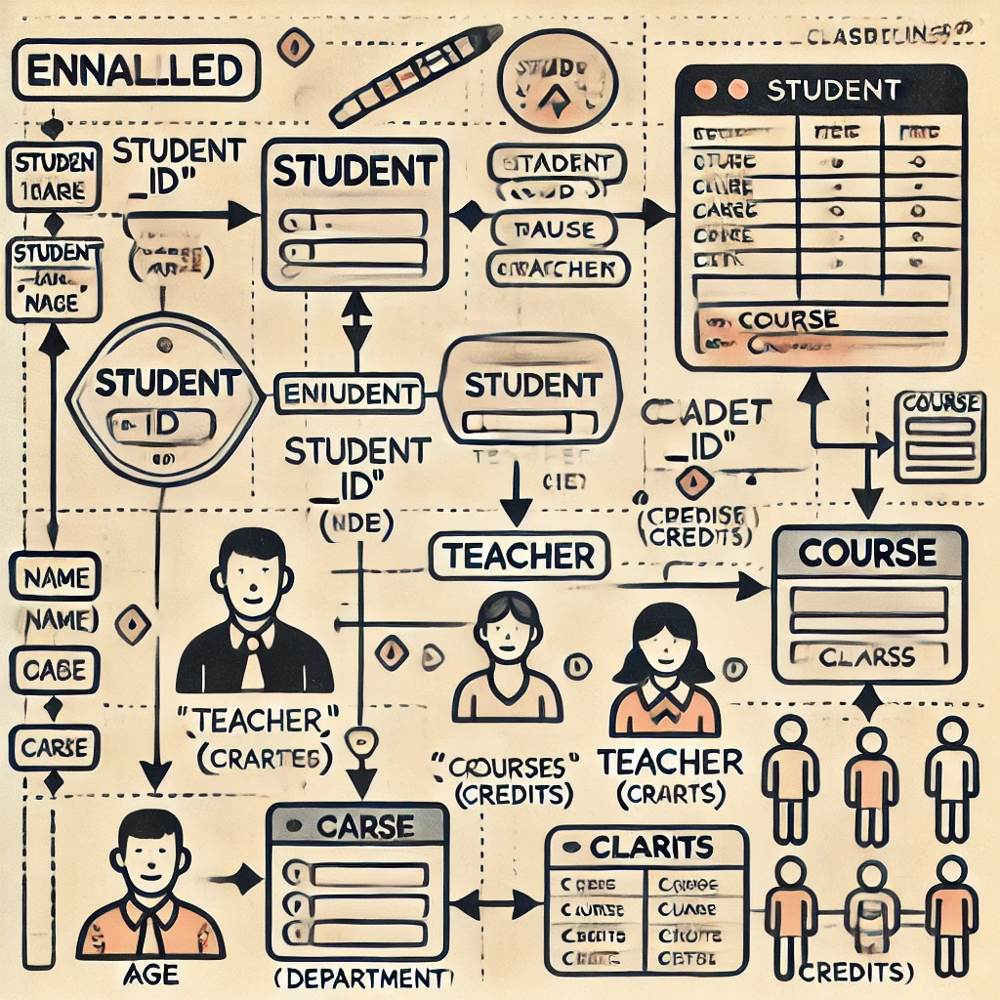

# Entità

I **Diagrammi Entità-Relazioni (ERD)** sono strumenti di modellazione dei dati utilizzati nell'ingegneria del software per rappresentare il modello concettuale dei dati di un sistema informativo. Servono per comprendere, documentare e comunicare la logica del database agli utenti.

### Scopi principali

1. Aiutare gli analisti a comprendere meglio i dati del sistema.
2. Funzionare come strumento di documentazione.
3. Connettere la struttura logica del database agli utenti finali.

### Componenti principali

1. **Entità**: Oggetti identificabili del mondo reale (es. studenti, insegnanti). Rappresentate con rettangoli, hanno attributi che le definiscono.
2. **Insieme di Entità**: Gruppi di entità correlate che condividono attributi simili (es. tutti gli studenti di una scuola). Possono sovrapporsi con altri insiemi di entità.

I diagrammi ER semplificano la comprensione e la progettazione di sistemi basati su database.

---

Nel modello ER, le **entità** sono rappresentate graficamente come **rettangoli**. Esistono due tipi principali di entità, ciascuna con una rappresentazione specifica:

1. **Entità forte**: È un'entità autonoma che non dipende da altre entità per la propria identificazione. È rappresentata con un **rettangolo singolo**.

2. **Entità debole**: È un'entità che non può essere identificata univocamente senza un'entità forte associata. È rappresentata con un **rettangolo doppio**. Inoltre, l'entità debole è sempre associata a una **relazione forte** (doppio rombo) e a una **chiave parziale** (attributo parziale), necessaria per completare la sua identificazione.

Ogni rettangolo è collegato ai suoi attributi (ellissi) e può essere associato ad altre entità tramite linee che indicano le relazioni.

---

