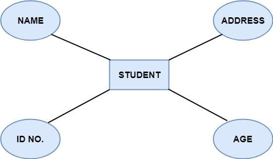

# Attributi

Gli **attributi** descrivono le proprietà di un'entità e ogni attributo possiede un valore specifico regolato da un **dominio** o intervallo di valori validi. Ad esempio, l'attributo "nome" di uno studente deve essere alfabetico, mentre l'attributo "età" non può essere negativo. Gli attributi possono essere di diversi tipi:

---

---

1. **Attributo chiave**: Identifica un'entità in modo univoco.
   - **Superchiave**: Un insieme di attributi che identifica un'entità in modo univoco.
   - **Chiave candidata**: Una superchiave minima, cioè senza attributi ridondanti. Possono esistere più chiavi candidate.
   - **Chiave primaria**: Una chiave candidata scelta per identificare un'entità in modo univoco.

---

---

2. **Attributo composto**: È una combinazione di più attributi, come un indirizzo, che include sotto-elementi come codice postale, stato e paese.

---

---

3. **Attributo a singolo valore**: Contiene un solo valore per entità, ad esempio il numero di previdenza sociale.

4. **Attributo a valori multipli**: Può avere più valori per entità, come numeri di telefono o indirizzi email. Nei diagrammi ER, sono rappresentati con una doppia ellisse.

---

5. **Attributo derivato**: Non esiste fisicamente nel database ma è calcolato da altri attributi, come l'età derivata dalla data di nascita. Rappresentato nei diagrammi ER con un'ellisse tratteggiata.

---

Gli attributi sono fondamentali per definire le caratteristiche delle entità e strutturare il database in modo efficace.

---

Gli **attributi** in un diagramma Entità-Relazioni (ER) sono rappresentati graficamente con **ellissi** collegate alle entità o alle relazioni. Ogni tipo di attributo ha una rappresentazione specifica:

1. **Attributo semplice**: Rappresentato con un'ellisse singola e collegato direttamente all'entità o alla relazione. Contiene un solo valore per ogni istanza (es. "Nome").

2. **Attributo composto**: Mostrato come un'ellisse principale collegata a sotto-ellissi, che rappresentano i componenti. Ad esempio, un attributo "Indirizzo" può essere suddiviso in "Città," "Stato," "Codice Postale."

3. **Attributo a valori multipli**: Disegnato con una **doppia ellisse**. Indica che l'entità può avere più valori per quell'attributo, come "Numeri di telefono."

4. **Attributo derivato**: Rappresentato con un'ellisse tratteggiata. Indica un valore calcolato da altri attributi, ad esempio "Età" derivata da "Data di nascita."

5. **Attributo chiave**: Mostrato come un'ellisse normale, ma il nome dell'attributo è **sottolineato** per indicare che identifica in modo univoco l'entità.

Queste rappresentazioni grafiche rendono chiaro il tipo e la funzione degli attributi all'interno del modello ER.

