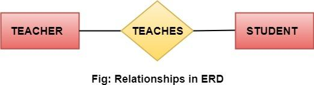

# Relazioni nei Diagrammi ER

Le **relazioni** rappresentano le associazioni tra entità e sono graficamente rappresentate con un **rombo**. Ad esempio:  

- Un dipendente *lavora_in* un dipartimento.  
- Uno studente *si iscrive* a un corso.  

In questi esempi, *lavora_in* e *si iscrive* sono relazioni.

---

#### Insieme di Relazioni  

Un **insieme di relazioni** raggruppa relazioni dello stesso tipo. Le relazioni, come le entità, possono avere attributi propri, chiamati **attributi descrittivi**.

#### Grado di una Relazione  

Il **grado di una relazione** indica il numero di entità partecipanti. I gradi più comuni sono:  

1. **Relazione unary (grado 1)**: Anche detta ricorsiva, si verifica tra istanze dello stesso tipo di entità. Esempio: una persona *è sposata con* un'altra persona.  

---

2. **Relazione binaria (grado 2)**: Si verifica tra istanze di due tipi di entità. Esempio: un insegnante *insegna* una materia.  

---

3. **Relazione ternaria (grado 3)**: Coinvolge istanze di tre tipi di entità. Ad esempio, un insegnante *assegna* un voto a uno studente per una materia.  

---

#### Relazioni n-arie  

Quando più di tre entità partecipano alla stessa relazione, questa è detta **n-aria**.  

Ogni tipo di relazione può includere molteplici partecipanti e cardinalità (es. uno-a-uno, uno-a-molti, molti-a-molti), che descrivono come le entità si associano tra loro.
