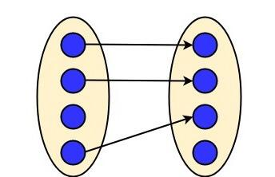

# Cardinalità delle Relazioni

La **cardinalità** definisce quante **entità** in un insieme di **entità** possono essere associate a **entità** di altri insiemi tramite una **relazione**. La cardinalità aiuta a descrivere il numero di istanze che possono partecipare a una **relazione** tra **entità**. Esistono diversi tipi di cardinalità:

---

#### 1. **Uno a Uno (1:1)**

Una singola **entità** di un insieme A può essere associata a al massimo una singola **entità** di un altro insieme B, e viceversa. Un esempio comune è la **relazione** tra **Studente** e **ID studente**: ogni studente ha un solo ID e ogni ID è assegnato a un solo studente.

In termini di insiemi:  
Se A è l'insieme degli studenti e B è l'insieme degli ID, la **relazione** uno a uno può essere rappresentata come:  
\[ A \times B \]

---

#### 2. **Uno a Molti (1:N)**

Un'**entità** di un insieme A può essere associata a più **entità** di un insieme B, ma ogni **entità** di B è associata a una sola **entità** di A. Un esempio potrebbe essere un **Cliente** e i suoi **Ordini**: un cliente può fare molti ordini, ma ogni ordine appartiene a un solo cliente.

In termini di insiemi:  
Se A è l'insieme dei clienti e B è l'insieme degli ordini, la **relazione** uno a molti può essere rappresentata come:  
\[ A \times B \] (dove un'**entità** di A si associa a molte **entità** di B)

---

#### 3. **Molti a Uno (N:1)**

In una **relazione** molti a uno, più **entità** dell'insieme A possono essere associate a una singola **entità** dell'insieme B, ma ogni **entità** di B è associata a molte **entità** di A. Un esempio potrebbe essere più **Studenti** che studiano in un **College**: molti studenti possono frequentare lo stesso college, ma ogni studente può frequentare solo un college.

In termini di insiemi:  
Se A è l'insieme degli studenti e B è l'insieme dei college, la **relazione** molti a uno può essere rappresentata come:  
\[ A \times B \] (dove molte **entità** di A si associano a una singola **entità** di B)

---

#### 4. **Molti a Molti (N:M)**

In una **relazione** molti a molti, ogni **entità** di A può essere associata a molte **entità** di B e viceversa. Un esempio comune è la **relazione** tra **Studenti** e **Progetti**: uno studente può essere assegnato a molti progetti e un progetto può essere assegnato a più studenti.

In termini di insiemi:  
Se S è l'insieme degli studenti e P è l'insieme dei progetti, la **relazione** molti a molti può essere rappresentata come il prodotto cartesiano tra gli insiemi S e P:  
\[ S \times P \]  
Questo rappresenta tutte le possibili coppie di associazione tra studenti e progetti.

In generale, una **relazione** molti a molti crea una tabella di associazione che memorizza tutte le coppie di **entità** coinvolte nella **relazione**.

---

Nel diagramma Entity-Relationship (ER), le **relazioni** sono rappresentate con **rombi** e la **cardinalità** delle relazioni è espressa con **linee** e **simboli specifici** che indicano quanti partecipanti di ciascuna **entità** possono essere coinvolti nella **relazione**. Ecco come vengono rappresentati i vari tipi di cardinalità nel diagramma ER:

---

### 1. **Uno a Uno (1:1)**

- **Rappresentazione**: Una **relazione** uno a uno è rappresentata da un **rombo** collegato da una linea a due **entità**, con una **linea singola** che unisce ciascuna **entità** al **rombo**, indicando che ogni **entità** è associata a una sola **entità** dell'altro insieme.
- **Esempio grafico**:  
  Se "Studente" è collegato a "ID Studente", il **rombo** rappresenta la **relazione** e la linea tra l'**entità** "Studente" e il **rombo** avrà una **singola linea** e lo stesso per l'**entità** "ID Studente".  
  *Una sola **entità** studente è associata a un solo ID studente e viceversa.*

---

Usando gli insiemi

---

### 2. **Uno a Molti (1:N)**

- **Rappresentazione**: Una **relazione** uno a molti è rappresentata da un **rombo** collegato a una delle **entità** tramite una **linea singola** e all'altra **entità** tramite una **linea con una "coda"** che indica che una sola **entità** di un insieme (es. "Cliente") può essere associata a molte **entità** di un altro insieme (es. "Ordini").
- **Esempio grafico**:  
  Se un "Cliente" fa più "Ordini", la **relazione** tra "Cliente" e "Ordine" avrà una **linea singola** per "Cliente" e una **linea con una coda** (che rappresenta "molti") per "Ordine".  
  *Un cliente può fare molti ordini, ma un ordine è associato a un solo cliente.*

---

Usando gli insiemi

---

### 3. **Molti a Uno (N:1)**

- **Rappresentazione**: Una **relazione** molti a uno è simile alla **relazione** uno a molti, ma con la posizione delle **entità** invertite. L'**entità** che può avere più associazioni (es. "Studenti") sarà collegata al **rombo** con una **linea con una coda** e l'**entità** che può avere una sola associazione (es. "College") sarà collegata con una **linea singola**.
- **Esempio grafico**:  
  Se più studenti frequentano lo stesso "College", il **rombo** che rappresenta la **relazione** tra "Studente" e "College" avrà una **linea con una coda** verso "Studente" e una **linea singola** verso "College".  
  *Molti studenti possono frequentare lo stesso college, ma uno studente può frequentare solo un college.*

---

Usando gli insiemi

---

### 4. **Molti a Molti (N:M)**

- **Rappresentazione**: Una **relazione** molti a molti è rappresentata con un **rombo** collegato a entrambe le **entità** tramite **linee con una coda** che indicano che entrambe le **entità** possono essere associate a molte istanze dell'altra **entità**. Una **relazione** molti a molti spesso richiede una ****entità** intermedia** (o una tabella di associazione) per gestire le coppie di associazione.
- **Esempio grafico**:  
  Se "Studenti" sono associati a "Progetti", un **rombo** con **linee con una coda** collegherà "Studenti" e "Progetti", indicando che molti studenti possono essere associati a molti progetti, e viceversa.  
  *Ogni studente può essere assegnato a più progetti e ogni progetto può coinvolgere più studenti.*

---

Usando gli insiemi

---

### Simboli di Cardinalità nei Diagrammi ER

-

Nel diagramma ER, le cardinalità sono rappresentate con simboli specifici sulle linee che collegano le **entità** alle relazioni. Questi simboli indicano quante istanze di un'**entità** possono essere associate a quante istanze di un'altra **entità**. Ecco una descrizione dei simboli di cardinalità:

1. **Uno a Uno (1:1)**:
   - **Simbolo**: Una linea singola da ciascuna **entità** al **rombo** della **relazione**.
   - **Indicazione**: Ogni **entità** dell'insieme A è associata a una sola **entità** dell'insieme B e viceversa.

2. **Uno a Molti (1:N)**:
   - **Simbolo**: Una linea singola da un'**entità** al **rombo** e una linea con una **"coda"** (triangolare) dall'altra **entità** al **rombo**.
   - **Indicazione**: Un'**entità** del primo insieme (A) può essere associata a molte **entità** del secondo insieme (B), ma ogni **entità** di B è associata a una sola **entità** di A.

3. **Molti a Uno (N:1)**:
   - **Simbolo**: Una linea con una **"coda"** (triangolare) da un'**entità** al **rombo** e una linea singola dall'altra **entità** al **rombo**.
   - **Indicazione**: Più **entità** del primo insieme (A) sono associate a una singola **entità** del secondo insieme (B).

4. **Molti a Molti (N:M)**:
   - **Simbolo**: Due linee con **"code"** (triangolari) da ciascuna **entità** al **rombo** della **relazione**.
   - **Indicazione**: Ogni **entità** di A può essere associata a più **entità** di B e viceversa. Questo tipo di **relazione** è spesso rappresentato come una **relazione** tra **entità** intermedie che gestiscono le associazioni molte a molte.

Questi simboli di cardinalità aiutano a chiarire il numero di associazioni tra le **entità** nel sistema, rendendo il diagramma ER un potente strumento di progettazione e documentazione del database.
